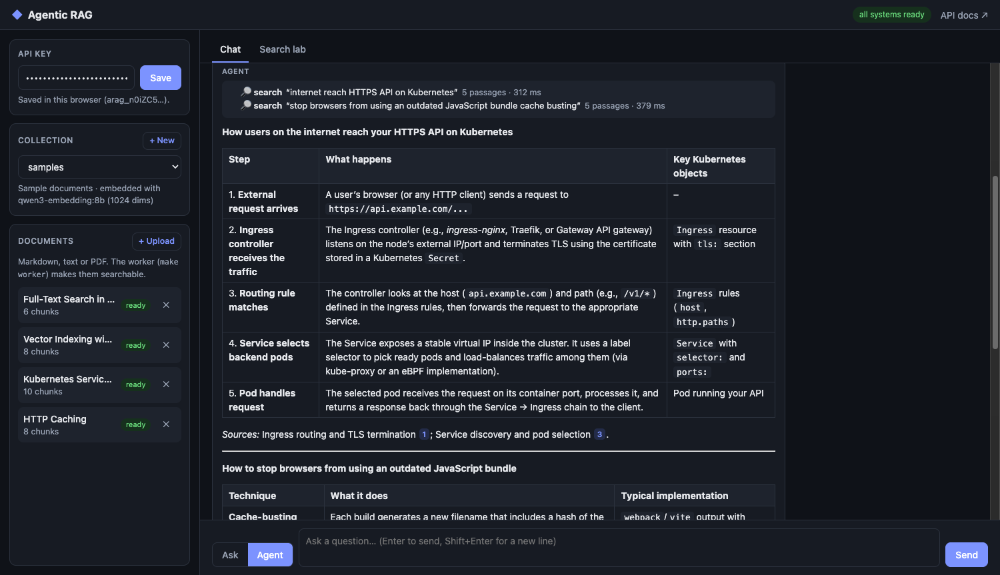
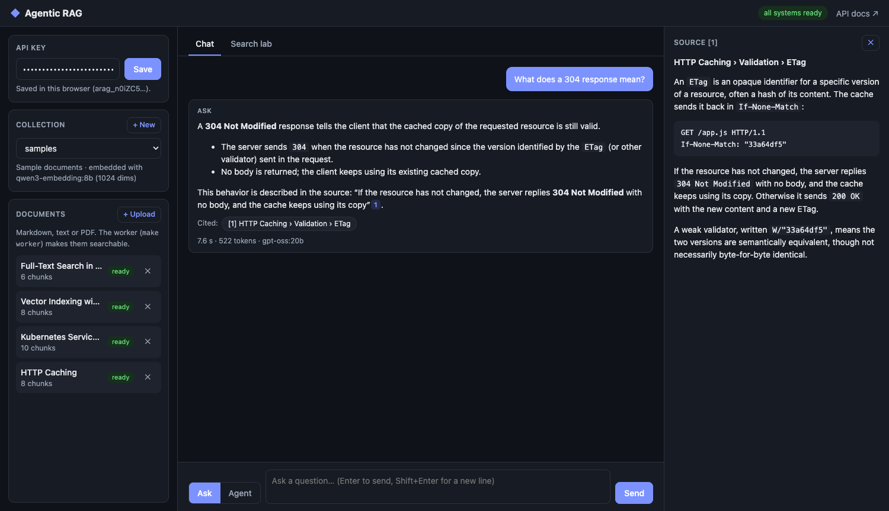
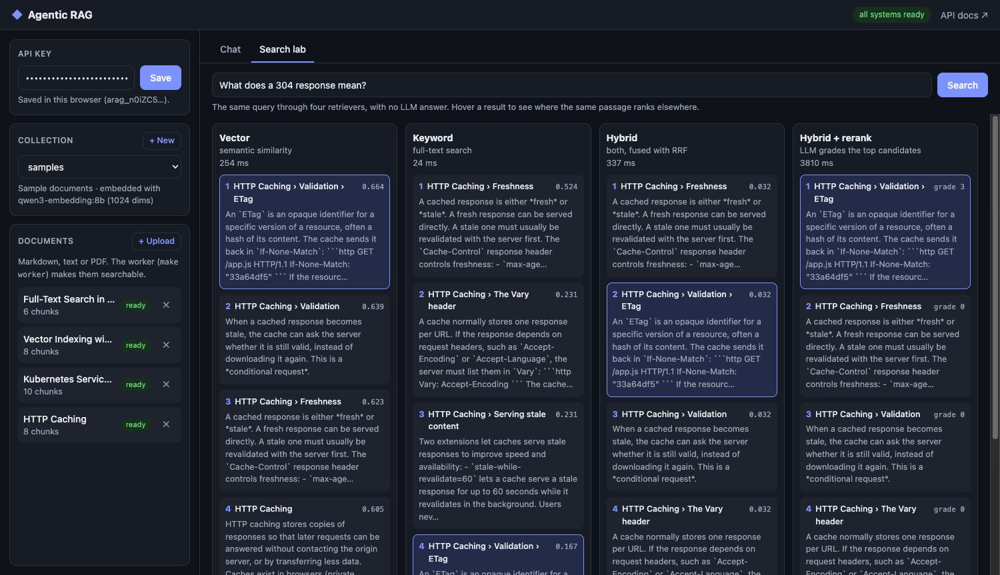
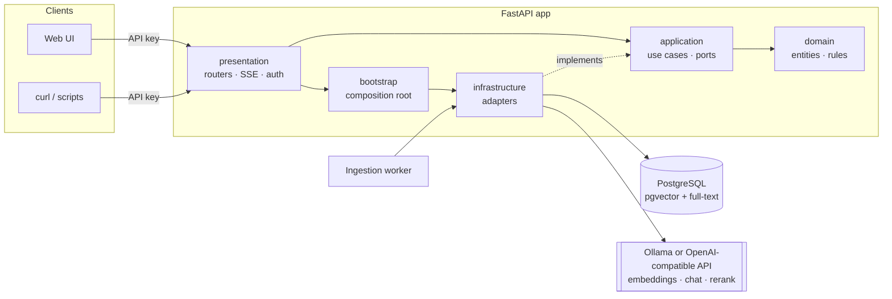
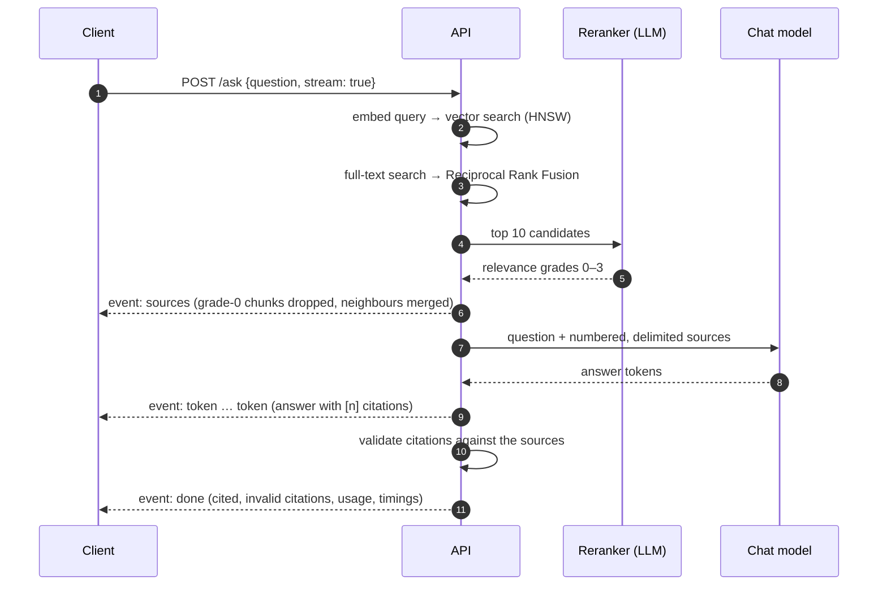

# Agentic RAG

[](https://github.com/harishthakuri/agentic-rag/actions/workflows/ci.yml)


[](LICENSE)

**Ask questions about your documents and get answers that cite their sources.** It combines hybrid search (semantic + keyword), LLM reranking, and an agent that plans its own searches. Every answer is checked for citations, and quality is measured with an evaluation harness rather than judged by eye. It runs fully locally with [Ollama](https://ollama.com), or with any OpenAI-compatible API by changing three settings.

Built as a learning project with production habits: Clean Architecture enforced in CI, least-privilege database roles, typed code, about 200 tests, and Docker.



## Highlights

- **Hybrid retrieval in PostgreSQL alone:** pgvector HNSW for meaning, full-text search for exact terms, fused with Reciprocal Rank Fusion. No separate vector database.
- **LLM reranking:** the chat model grades the top candidates (0–3) for how well they *answer* the question, and falls back safely if it fails.
- **Two ways to answer:**
  - `/ask` runs one search, assembles context and streams a cited answer.
  - `/agent/ask` uses tool calling: the model decides what to search, how often, and when to stop. Every step is streamed and stored for replay.
- **Grounded by design:** sources are delimited and treated as untrusted, citations are validated, and when nothing relevant is found the LLM isn't called at all.
- **Ingestion pipeline:** Markdown, text or PDF go through heading-aware chunking, a contextual header on each chunk, and embeddings, run by a background worker on a Postgres job queue (`FOR UPDATE SKIP LOCKED`, leases, retries with backoff).
- **Measured quality:** 27 labelled questions, recall/MRR/nDCG for retrieval, and an LLM judge for correctness and faithfulness ([results](docs/EVALUATION.md)).
- **Web UI:** streamed chat with clickable citations, a live agent timeline, and a search lab that compares retrieval strategies side by side.

<table>
  <tr>
    <td></td>
    <td></td>
  </tr>
  <tr>
    <td align="center"><sub>Every citation opens the exact passage it came from</sub></td>
    <td align="center"><sub>Search lab: the same query through four retrieval strategies</sub></td>
  </tr>
</table>

## How it works, for non-technical readers

Three short PDFs:

- **[RAG, explained](docs/diagrams/rag-explained.pdf):** what RAG is; chunking, embeddings, vectors and vector databases; why both simple RAG and our Agentic RAG need just two AI models; and Ask vs Agent in detail.
- **[How a document becomes searchable](docs/diagrams/document-upload-flow.pdf):** upload, background processing, and the one step where AI is used.
- **[How a question gets an answer](docs/diagrams/question-answer-flow.pdf):** search, AI review, a cited answer, and the guards against made-up answers.

## Architecture



The layers follow Clean Architecture: **dependencies point inwards**, `domain` and `application` contain no framework code, and every external system sits behind a port (`EmbeddingProvider`, `ChatModel`, `Reranker`, `ChunkSearchIndex`, `UnitOfWork`, …). [import-linter](https://github.com/seddonym/import-linter) enforces this in CI. Swapping Ollama for OpenAI, or the LLM reranker for a cross-encoder, is a configuration change in one place: [`app/bootstrap/container.py`](app/bootstrap/container.py).

| Layer | Responsibility |
|---|---|
| [`app/domain`](app/domain) | Entities (`Collection`, `Document`, `Chunk`, `IngestionJob`, `AgentRun`), value objects, repository interfaces, rank fusion |
| [`app/application`](app/application) | Use cases (ingest, search, ask, agent), ports, versioned prompts |
| [`app/infrastructure`](app/infrastructure) | SQLAlchemy + pgvector, OpenAI-compatible clients, parsers, chunker, storage, worker queue |
| [`app/presentation`](app/presentation) | REST API, SSE streaming, auth, RFC 9457 errors, admin CLI, web UI |
| [`app/bootstrap`](app/bootstrap) | Composition root: wires adapters to ports |

### How a question is answered



In **agent mode**, the chat model receives tools instead (`search_knowledge_base`, `read_more_context`, `list_documents`) and loops: call a tool, read the result, decide what to do next. Guards bound the loop: a tool-call limit, a prompt-size limit, a wall-clock timeout, and errors returned to the model as text so it can correct itself.

## Evaluation

A labelled question set is run against the real system ([method and full results](docs/EVALUATION.md)):

| System | Correctness | Faithfulness | Answers with citations | Declined unanswerable | p50 latency |
|---|---|---|---|---|---|
| `/ask` (hybrid + LLM rerank) | 1.00 | 0.97 | 79% | 3/3 | 7.6 s |
| `/agent/ask` | 1.00 | 0.95 | 88% | 3/3 | 6.3 s |

<sub>Local run: `qwen3-embedding:8b`, `gpt-oss:20b` (also the judge), M1 Max.</sub>

What the numbers say:

- **The sample corpus is too easy to separate retrieval strategies:** plain vector search already scores 1.00 recall.
- **The remaining weakness is citation discipline:** some answers cite nothing, even though every citation that does appear is correct.
- **The evaluation caught three bugs before it produced trustworthy numbers,** two of them in production code.

## What needs to be running

| Component | What it does | Local (`make …`) | Docker Compose |
|---|---|---|---|
| **PostgreSQL + pgvector** | Stores documents, passages, embeddings and jobs | Your own server | `postgres` container |
| **Ollama** | Runs the AI models (embeddings and chat) | Ollama app on your machine | On the host (see below) |
| **API server** | Web UI, REST API; searching and answering | `make run` | `api` container |
| **Ingestion worker** | Turns uploaded files into searchable passages | **`make worker`** (separate terminal) | `worker` container, starts automatically |

> [!IMPORTANT]
> **The ingestion worker is a separate process.** Without it, uploads are accepted but stay **pending** forever, and nothing becomes searchable. Docker Compose starts it for you. In local development, run `make worker` alongside `make run`. The UI flags documents that have been pending for a while.

## Quickstart

### With Docker

Requires Docker and [Ollama](https://ollama.com) on the host with the models pulled:

```bash
ollama pull qwen3-embedding:8b && ollama pull gpt-oss:20b

docker compose up -d --build            # Postgres + pgvector, migrations, API, worker
docker compose exec api rag-admin api-key create --name dev
open http://localhost:8000              # paste the key into the sidebar
```

Then upload Markdown, text or PDF files in the UI, or load the sample documents with `RAG_API_KEY=arag_... make ingest-samples`.

Ollama runs on the host (Docker on macOS can't use the Apple GPU). Point the containers at it with `OLLAMA_URL`:

| Runtime | `OLLAMA_URL` |
|---|---|
| Docker Desktop | `http://host.docker.internal:11434` (default) |
| Rancher Desktop | `http://host.lima.internal:11434` |
| Linux | default, with Ollama started using `OLLAMA_HOST=0.0.0.0` |

The image is about 80 MB on a slim Python base. It runs as a non-root user and plays three roles: API, worker (`rag-worker`) and migrations (`alembic upgrade head`).

### Local development

Requires [uv](https://docs.astral.sh/uv/), PostgreSQL 16+ with [pgvector](https://github.com/pgvector/pgvector), and Ollama.

```bash
# 1. Least-privilege database roles: run once as a superuser (instructions in the file)
psql -h <db-host> -U postgres -d simple-rag-db -f scripts/db/001_roles.sql

# 2. Configure, install, migrate
cp .env.example .env          # fill in the role passwords from step 1
make install                  # dependencies + git hooks
make migrate

# 3. Run: both are needed (two terminals)
make run                      # terminal 1: API + UI at http://localhost:8000
make worker                   # terminal 2: ingestion worker (without it, uploads stay "pending")

make api-key name=dev         # create an API key (shown once)
```

To use OpenAI instead of Ollama, set `LLM_BASE_URL`, `LLM_API_KEY` and `LLM_MODEL` in `.env`. Embeddings are configured separately (`EMBEDDING_*`).

## Using the API

Interactive docs are at `/docs`. Every `/api/v1` route needs `Authorization: Bearer <api key>`. Errors use [RFC 9457 Problem Details](https://www.rfc-editor.org/rfc/rfc9457).

| Endpoint | Purpose |
|---|---|
| `POST /api/v1/collections` · `GET` · `DELETE /{id}` | Manage collections (named sets of documents, bound to one embedding model) |
| `POST /api/v1/collections/{id}/documents` | Upload a file → `202 Accepted` + an ingestion job |
| `GET /api/v1/jobs/{id}` · `GET /api/v1/documents/{id}` | Ingestion progress |
| `POST /api/v1/collections/{id}/search` | Retrieval only: `mode` = `vector` / `keyword` / `hybrid`, optional `rerank` |
| `POST /api/v1/collections/{id}/ask` | One-shot RAG answer with citations (`"stream": true` for SSE) |
| `POST /api/v1/collections/{id}/agent/ask` | Agentic search (`"stream": true` for SSE) |
| `GET /api/v1/agent/runs/{id}` | Replay an agent run step by step |
| `GET /health/live` · `GET /health/ready` | Liveness; readiness of the database and both models |

```bash
curl -N -X POST localhost:8000/api/v1/collections/$COLLECTION/agent/ask \
  -H "Authorization: Bearer $RAG_KEY" -H "Content-Type: application/json" \
  -d '{"question": "Compare HNSW and IVFFlat: how is each built?", "stream": true}'
```

### Authentication

API keys are random 256-bit secrets, shown once at creation (`make api-key name=dev`). The database stores only their SHA-256 hash, so a copy of the database doesn't expose usable keys. Give each client its own key, so you can revoke one (`uv run rag-admin api-key revoke <id>`) without affecting the others.

## Design decisions and lessons learned

The full reasoning is in the [implementation plan](docs/IMPLEMENTATION_PLAN.md). The highlights:

| Decision | Why |
|---|---|
| **pgvector instead of a separate vector database** | One system for data, vectors and full-text search, with transactional consistency |
| **Embeddings truncated from 4096 to 1024 dimensions** | pgvector's HNSW index supports at most 2,000 dimensions; Matryoshka-trained models keep most of their quality when shortened |
| **Asymmetric embeddings** | Qwen3-Embedding expects an instruction on queries but not on documents, so the port has separate `embed_query` and `embed_documents` |
| **OR semantics for keyword search** | `websearch_to_tsquery` requires *every* word, so natural questions matched nothing; questions now match any stemmed term and are ranked by `ts_rank_cd` |
| **Contextual chunk headers** | Each chunk is embedded with its document title and section path, so a passage like "it defaults to port 80" keeps its meaning |
| **Hand-written agent loop, not a framework** | Every step is visible, testable and bounded; frameworks tend to blur architectural boundaries |
| **Least-privilege database roles** | The API can't run DDL; only migrations use the schema-owner role |

Testing against the real models taught more than the unit tests did:

- **JSON schemas must say exactly what you want.** With a generic schema, `gpt-oss` returned `{"grades": []}` every time. Requiring *exactly n* items fixed it.
- **Put instructions where the model is looking.** A citation rule only in the system prompt was ignored by the agent; repeating it in every tool result worked. "One topic per query" in the *tool description* made the agent split multi-part questions.
- **Models have habits.** `gpt-oss` cites as `【1】` (normalised to `[1]`), attaches citations to words (`mode[1]`), and writes `couldn’t` with a curly apostrophe. Each of these broke a check until it was handled.
- **Never trust an evaluation you haven't audited.** The first evaluation run looked plausible but hid three bugs.

## Tech stack

| Area | Choice |
|---|---|
| API | FastAPI, Pydantic, Server-Sent Events |
| Database | PostgreSQL 16, pgvector (HNSW), full-text search (GIN), SQLAlchemy 2 (async), Alembic |
| Models | Ollama: `qwen3-embedding:8b` (1024 dims) and `gpt-oss:20b`, through the OpenAI SDK, so any OpenAI-compatible API works |
| Ingestion | Heading-aware Markdown parser, pypdf, tiktoken, Postgres job queue |
| UI | Plain HTML/CSS/JS (no build step), marked + DOMPurify, strict CSP |
| Quality | pytest (unit, e2e, integration with testcontainers), mypy (strict), ruff, import-linter, pre-commit, GitHub Actions |
| Packaging | uv, multi-stage Docker image, docker compose |

## Project structure

```
app/
├── domain/            # entities, value objects, repository interfaces, rank fusion
├── application/       # use cases (ingestion, retrieval, answering, agent), ports, prompts
├── infrastructure/    # persistence, search SQL, LLM clients, reranker, parsers, chunker, storage
├── presentation/      # REST API, SSE, CLI (rag-admin), web UI
├── bootstrap/         # composition root
├── main.py            # FastAPI app factory
└── worker.py          # ingestion worker (rag-worker)
alembic/               # migrations
evals/                 # evaluation harness and labelled dataset
scripts/               # DB role script, sample ingestion, search comparison
sample_data/           # small demo corpus
tests/                 # unit · e2e · integration (pgvector in Docker) · live (opt-in)
docs/                  # implementation plan, evaluation, screenshots
```

## Development

```bash
make check             # ruff + mypy + architecture contracts + unit/e2e tests
make test-integration  # integration tests against pgvector in Docker
uv run pytest -m live  # opt-in checks against your local Ollama models
make eval-retrieval    # retrieval evaluation (~3 min)
make eval              # full evaluation with LLM judge (~30 min locally)
make help              # all commands
```

## Roadmap

- **A harder evaluation corpus**, with overlapping topics, so hybrid search and reranking can be properly measured
- **A cross-encoder reranker:** the same precision for about 0.2 s instead of about 5 s?
- **Citation enforcement:** structured answers or a retry, measured by the evaluation
- **An independent, stronger judge model** for the evaluation

## License

[MIT](LICENSE)
